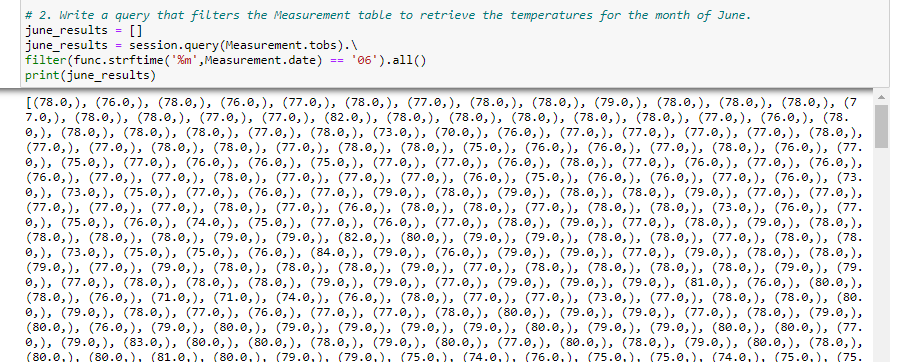
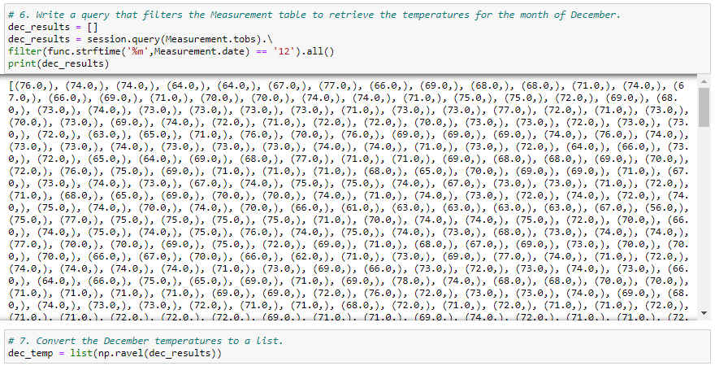
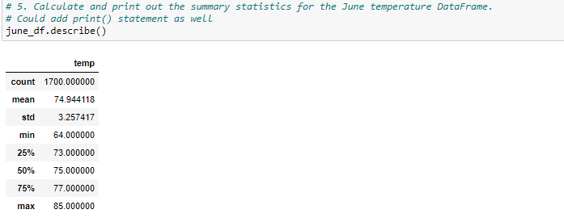
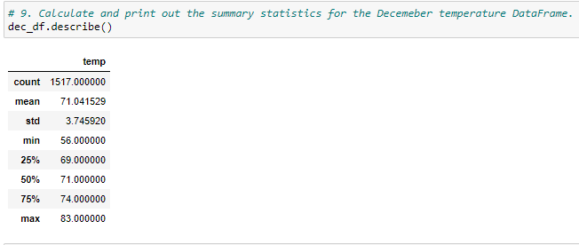
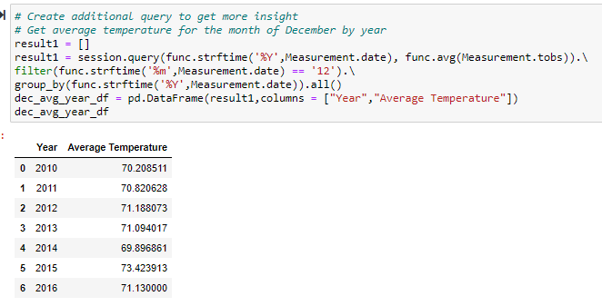
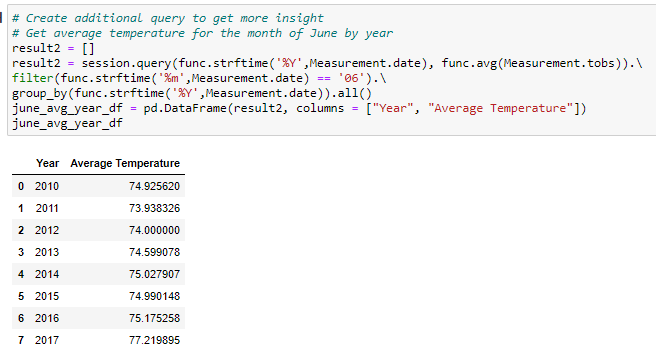

# surfs_up
Analyze Weather Data in Oahu Hawaii using Python

## Overview of Project
**Task:** Analyze weather data (specifically temperature) on Oahu island in Hawaii. 

**Purpose:** Identify temperature trends for the months of June and December in Oahu, in order to determine if a surf and ice cream shop business is sustainable year-round.

**Method:** Using Python, Pandas functions and methods, and SQLAlchemy. 

**The Analysis should include the following information:** 

1. Determine the Summary Statistics for June (by quering SQLite database)
2. Determine the Summary Statistics for December (by quering SQLite database)

## Resources
- Data Source: [hawaii.sqlite](hawaii.sqlite);
- Source Code: 
    [SurfsUp_Challenge](SurfsUp_Challenge.ipynb); 
  
- Software: Python 3.7.9 64-bit (conda); jupyter-notebook : 6.1.4
- SQLite Database 

## Results

- **Steps to analyze June temperature data:**

   - Filter the date column of the Measurements table in the hawaii.sqlite database to retrieve all the temperatures for the month of June
   - Convert the queried temperatures to a list and create a DataFrame from the list
   - Generate the summary statistics

   
    **Temperatures for June (Query)**

    

- **Steps to analyze December temperature data:**
   - Filter the date column of the Measurements table in the hawaii.sqlite database to retrieve all the temperatures for the month of December
   - Convert the queried temperatures to a list and create a DataFrame from the list
   - Generate the summary statistics

    **Temperatures for December (Query)**

    

- **Findings:**
    - We have more data points for the month of June (1700 for June vs. 1517 for December)
    - The temperature in June is on average higher by 3.9 degrees compared to December
    - The temperature difference in December is slightly more than in June (both months have sd over 3 degrees; June sd = 3.26; December sd = 3.75) -> higher spread of data in December might indicate more frequent and significant change in temperature

    **Oahu June Temperature Summary Statistics**
   
    

    **Oahu December Temperature Summary Statistics**

    

## Summary

Based on the analysis of the temperature data points in June and December it seems that the weather is favorable year round for outdoor activities in Oahu and that the surf and ice cream shop business is sustainable year-round.

- **Additional queries to perform to gather more weather data for June and December:**
    - Get temperature data by year and compare year over year trends for June and December
    - Get min and max temperature for June and December by year 
    - Get average temperature for June and December (overall and by year)

**Example of Additional Queries:**

**Average Temperatures for December by Year (Query and Output)**

    

**Average Temperatures for June by Year (Query and Output)**

    
    